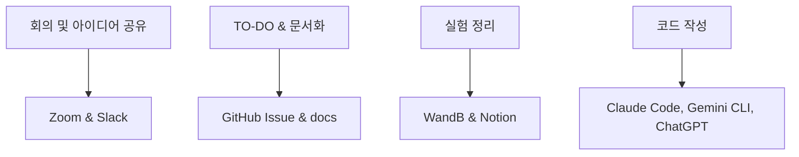

# 🗣️ NLP 경진대회 결과 발표 - 대화 요약 모델 개발

> **5조 - 티끌 모아 Tech**: "각자의 작은 기술이 모여 힘을 발휘한다!"

---

## 📋 프로젝트 개요

### 🎯 경진대회 정보
- **주제**: Dialogue Summarization (일상 대화 요약)
- **기간**: 2025.07.25 ~ 2025.08.06 (13일간)
- **목표**: 249개의 대화문에 대해 각각 1개의 요약문 생성
- **평가지표**: ROUGE (ROUGE-1, ROUGE-2, ROUGE-L)
- **데이터셋**: 학교 생활, 직장, 치료, 쇼핑, 여가, 여행 등 광범위한 일상 대화

### 🏆 최종 결과
- **중간 평가**: 9팀 중 **3위**
- **최종 평가**: **5위** (순위 하락)
- **최종 ROUGE 점수**: 45.58 (목표 50점 미달성)

---

## 👥 팀 소개

### 🔸 팀원 구성 및 역할

| 역할 | 이름 | 전공/배경 | 담당 업무 |
|------|------|-----------|-----------|
| **팀장** | 송규헌 | RAG / 경영정보 | EDA, 베이스라인 작성, 자료조사 |
| **팀원** | 이상현 | AI응용분야찾기 / 재료공학 | Dialogue-Summary 간 상관관계 분석, 데이터 특성 추출 |
| **팀원** | 이영준 | MLOps / 컴퓨터공학 | 자동화 구축, 다양한 모델 및 옵션 조합 실험 |
| **팀원** | 조은별 | 고분자공학과 | 특수 표현 전처리 및 마스킹 토큰화 |
| **팀원** | 편아현 | 소프트웨어학과 | 데이터 전처리 및 Optuna를 통한 하이퍼파라미터 튜닝 |

### 🛠️ 협업 도구 및 방식



- **커뮤니케이션**: Zoom, Slack
- **프로젝트 관리**: GitHub Issue, Notion
- **실험 추적**: WandB
- **AI 어시스턴트**: Claude Code, Gemini CLI, ChatGPT

---

## 🔬 기술적 접근 방법

### 1️⃣ 개발 환경 구축

```python
# 주요 라이브러리 및 버전
Python 3.11 (conda 가상환경)
PyTorch 2.6.0
transformers 4.54.0
pytorch-lightning 2.5.2
rouge, rouge-score (평가 metric)
wandb (실험 관리)
unsloth, gradio, evaluate (추론/서빙/평가)
pandas, numpy, tqdm (데이터 처리/분석)
kiwipiepy (형태소 분석, 한국어 전처리)
```

### 2️⃣ 데이터 분석 (EDA)

#### 📊 대화문 및 요약문 길이 분포 분석

**주요 발견사항:**
- **대화문 길이**: train/val/test 모두 100~600자에 주로 분포
- **요약문 길이**: 
  - train/val: 40~100자에 집중
  - test: 80~150자 구간에 더 많이 분포 (최대 400자 이상)
- **Test 데이터의 특성**: 전반적으로 더 긴 대화문과 요약문 포함

#### 🔍 토큰 수 분포 분석

```python
# 요약문 토큰 수 분포 특성
train/val: 주로 20~40 토큰
test: 40~60 토큰에 집중, 100개 이상 토큰도 일부 존재
```

#### 📈 대화문-요약문 길이 상관관계

- **Train/Val**: 상관계수 0.66, 0.64로 유의미한 관계
- **Test**: 유의미한 상관관계 없음
- **시사점**: Test 데이터의 특성이 Train/Val과 상이함

### 3️⃣ 데이터 전처리

#### 🧹 텍스트 정제

```python
def clean_text(text: str) -> str:
    # 줄바꿈 표현 통일
    text = text.replace("\\n", "\n").replace("<br>", "\n")
    
    # 특이 케이스 처리
    text = text.replace("ㅎㅎ", "나도 행복해.")
    
    # 자음/모음 약어 제거 (ㅋㅋ, ㅇㅋ, ㅜㅜ 등)
    text = re.sub(r"\b[ㄱ-ㅎㅏ-ㅣ]{2,}\b", "", text)
    
    # 중복 공백 제거
    text = re.sub(r"\s+", " ", text)
    
    return text.strip()
```

#### 🔧 지시표현 보완 및 프롬프트 추가

- **지시어 치환**: "그 사람", "이것" 등을 직전 발화자 정보로 대체
- **메타정보 프롬프트**: `#Topic#`, `#Dialogue#` 등 special token 연동
- **BART 포맷 변환**: bos_token, eos_token에 맞게 인코더/디코더 입력 구성

### 4️⃣ 데이터 증강 (Back Translation)

#### 🌐 Solar API를 활용한 역번역

```python
# 한국어 → 영어 → 일본어 → 한국어 순서로 Back Translation
def back_translate_pipeline(text):
    ko_to_en = translate_solar_api(text, "ko", "en")
    en_to_ja = translate_solar_api(ko_to_en, "en", "ja") 
    ja_to_ko = translate_solar_api(en_to_ja, "ja", "ko")
    return ja_to_ko
```

**증강 효과:**
- 기존 데이터셋을 2배로 확장
- **ROUGE 점수 1점 상승** (44.62 → 45.58)

#### 📋 증강 전후 비교

| 구분 | ROUGE-1 | ROUGE-2 | ROUGE-L | 최종 점수 |
|------|---------|---------|---------|-----------|
| **증강 전** | 0.5486 | 0.3703 | 0.4794 | 47.277 |
| **증강 후** | 0.5758 | 0.3824 | 0.4922 | 48.3465 |

### 5️⃣ 모델링 (KoBART 기반)

#### 🧠 모델 아키텍처

```python
# HuggingFace BartForConditionalGeneration 활용
model_name = "digit82/kobart-summarization"
tokenizer = AutoTokenizer.from_pretrained(model_name)
model = BartForConditionalGeneration.from_pretrained(model_name)

# Special Token 처리
special_tokens = ["#Person1#", "#Person2#", "#PhoneNumber#", ...]
tokenizer.add_special_tokens({"additional_special_tokens": special_tokens})
model.resize_token_embeddings(len(tokenizer))
```

#### ⚙️ 하이퍼파라미터 최적화

**주요 설정값:**
- **Encoder max_length**: 512 (1026보다 성능 우수)
- **Decoder max_length**: 200 (정보 손실 없이 충분한 길이)
- **Beam Search**: num_beams=2 (성능과 속도의 최적 균형)

#### 🔍 모델 성능 인사이트

> **핵심 발견**: 대화문 앞부분 중심의 정보만 활용하는 것이 요약 성능에 유리

### 6️⃣ 추론 및 제출

#### 🎯 추론 파이프라인

```python
with torch.no_grad():
    for item in tqdm(dataloader):
        generated_ids = model.generate(
            input_ids=item['input_ids'].to(device),
            attention_mask=item['attention_mask'].to(device),
            early_stopping=True,
            max_length=200,
            num_beams=2,
            length_penalty=1.0
        )
        result = tokenizer.decode(generated_ids[0], skip_special_tokens=True)
        summaries.append(result)
```

---

## 💡 주요 인사이트 및 학습

### 🚫 데이터 전처리의 역설

**문제 상황:**
- 데이터에서 `\n`, `<br>`, `...`, `ㅎㅎ` 등 전처리가 필요해 보이는 요소들 발견
- 대괄호([])로 감싸진 문장들의 화자 분리 필요성 인식

**예상과 다른 결과:**
- 전처리를 할수록 **성능이 오히려 하락**
- 사람이 보기에 자연스러운 전처리가 모델 성능에는 부정적 영향

**핵심 인사이트:**
> 데이터 중 전처리 해야할 부분들이 보이지만, 전처리를 할수록 성능이 떨어짐. 모델이 원본 데이터의 노이즈도 학습 정보로 활용하는 것으로 추정.

### 📈 데이터 증강의 효과

**Back Translation 성과:**
- 단순한 데이터 양 확장을 넘어선 **질적 개선 효과**
- 다양한 표현 방식 학습으로 모델의 일반화 성능 향상
- **비용 대비 효과가 높은 증강 기법**

### ⚖️ 하이퍼파라미터 튜닝의 교훈

**의외의 발견:**
- 배치 크기를 크게, patience를 길게, decoder 길이를 짧게, beam depth를 줄이는 등의 "최적화"가 실제로는 큰 개선 없음
- **데이터셋 및 태스크 특성에 맞는 적정/보수적 하이퍼파라미터가 더 우수**

**실용적 접근:**
- Encoder max_length: 512 (대화문 앞부분 집중)
- Decoder max_length: 200 (충분하면서도 불필요한 문장 방지)
- Beam search: 2 (성능과 속도의 균형점)

---

## 📊 최종 결과 및 성과

### 🏅 리더보드 결과

| 평가 단계 | 순위 | 총 팀 수 | ROUGE 점수 |
|----------|------|----------|------------|
| **중간 평가** | 3위 | 9팀 | 48.3465 |
| **최종 평가** | 5위 | 9팀 | 45.5898 |

### 📈 목표 달성도

| 목표 항목 | 달성도 | 비고 |
|-----------|--------|------|
| 대화 요약 모델 파인튜닝 및 실전 파이프라인 경험 | ✅ 완료 | KoBART 기반 end-to-end 파이프라인 구축 |
| 다양한 전처리 및 데이터 정제 기법 실험 | ✅ 완료 | 전처리 역설 현상 발견 |
| 역번역 기반 데이터 증강 실험 | ✅ 완료 | 1점 성능 향상 달성 |
| ROUGE 기반 신뢰성 있는 평가 및 검증 전략 수립 | ✅ 완료 | 체계적인 실험 추적 |
| 베이스라인 코드 기반 체계적 실험 | 🔺 부분 달성 | 시간 제약으로 일부 실험 미완료 |
| **목표 점수: ROUGE 평균 50 이상** | ❌ 미달성 | **45.58점 (목표 대비 4.42점 부족)** |

---

## 🤔 회고 및 학습

### 📝 팀원별 소감

#### 👤 송규헌 (팀장)
> CV 경진대회와 마찬가지로 코드를 개선하는 데 시간을 많이 소요해 요약 task 논문 조사를 많이 하지 못한 것이 아쉽다. DialogSum 논문에 기반해 계획은 잘 수립했지만, 또 코드 때문에 계획대로 하지 못했던 것 같다.

#### 👤 이상현
> 요약이라는 Task를 딥러닝으로 해결하는 기법을 강의로 듣고 AI의 타산업의 적용이라는 주제를 깊이 고민할 수 있었다. 2인 대화록에서 요약을 끌어내는 Task란 인간만이 가진 함축적 사고력의 결과를 담아야 하는 주제라 심도있는 문제라는 걸 배우게 되었다.

#### 👤 이영준
> 자동화를 구축하여 다양한 실험을 하려고 하였습니다. 두 대형 모델을 사용해서 실험을 하려고 며칠을 고생하면서 했지만, 끝내 Claude MCP가 해결 못하는 부분이 있어서 해당 작업은 포기하고, 조에서 공통으로 사용하는 것으로 하게 되었습니다. 오랜시간 공들인 것이 허사가 된 부분이 있어서 아쉽습니다.

#### 👤 조은별
> Solar API로 프롬프트 기반 Back Translation을 직접 실험해보면서, 프롬프트의 작은 차이만으로도 결과 품질이 크게 달라진다는 점을 실감했다. 모델이 다양한 대화와 요약 데이터를 학습해 자동으로 요약을 생성하는 과정에서, 정확하고 구조화된 프롬프트가 성능에 매우 중요하다는 점을 확인했다.

#### 👤 편아현
> 전처리를 통해 더 좋은 결과를 기대했지만, 오히려 성능이 떨어져서 아쉬웠습니다. 사람이 보기에 더 자연스럽도록 전처리한 게 잘못됐던 것인지, 성능 저하의 원인이 아직도 의문입니다. 우리 팀을 포함한 다른 팀들도 멘토링 이후에 갑자기 치고 올라왔는데, 확실히 멘토링에서 인사이트를 많이들 얻어가는 것 같습니다.

### 🎯 프로젝트 성과 종합

#### ✅ 잘했던 점

1. **체계적인 역할 분배**: 각자의 전문성을 살린 업무 분담
2. **효과적인 협업**: TODO 리스트 작성 및 결과 기록 체계화
3. **건설적인 토론**: 의견 충돌을 통한 아이디어 발전
4. **멘토링 활용**: 양질의 정보 획득 및 다양한 시도 실행

#### 🔍 아쉬웠던 점

1. **시간 관리**: 마지막 날 시간 부족으로 추가 실험 기회 상실
2. **이론적 배경**: 논문 조사 시간 부족으로 인한 깊이 있는 접근 한계
3. **기술적 도전**: 일부 고도화된 실험 도구 활용 실패

#### 🚀 향후 계획

> 다음에도 이런 대회를 참여한다면 이번 인사이트를 기반으로 더 높은 점수를 노려보고 싶다.

**개선 방향:**
1. **사전 준비**: 관련 논문 및 최신 기법 사전 조사
2. **시간 배분**: 실험과 분석을 위한 충분한 시간 확보
3. **도구 숙련도**: 협업 도구 및 실험 환경 사전 구축

---

## 🔗 관련 자료

### 📚 기술 스택

- **Framework**: PyTorch, Transformers, PyTorch Lightning
- **Model**: KoBART (digit82/kobart-summarization)
- **Data Augmentation**: Solar API (Back Translation)
- **Evaluation**: ROUGE-1, ROUGE-2, ROUGE-L
- **Collaboration**: GitHub, WandB, Notion, Zoom, Slack

### 🛠️ 주요 라이브러리

```python
transformers==4.54.0
pytorch-lightning==2.5.2
torch==2.6.0
rouge-score
wandb
kiwipiepy
pandas
numpy
```

### 📊 최종 성능 지표

```python
Final ROUGE Scores:
├── ROUGE-1: 0.5535
├── ROUGE-2: 0.3487  
├── ROUGE-L: 0.4654
└── Final Score: 45.5898
```

---

## 💬 결론

이번 NLP 경진대회를 통해 **대화 요약**이라는 복잡한 자연어처리 태스크에 대한 실질적인 경험을 쌓을 수 있었습니다. 특히 데이터 전처리의 역설, 데이터 증강의 효과, 그리고 하이퍼파라미터 튜닝의 실용적 접근법 등 **이론과 실무 사이의 간극**을 체험할 수 있는 귀중한 기회였습니다.

목표 점수에는 도달하지 못했지만, **팀워크를 바탕으로 한 체계적인 실험과 분석**을 통해 NLP 모델 개발의 전 과정을 경험하며 실질적인 성장을 이룰 수 있었습니다.

> **"각자의 작은 기술이 모여 힘을 발휘한다"** - 우리 팀의 슬로건처럼, 다양한 배경의 팀원들이 협력하여 하나의 목표를 향해 나아가는 과정에서 진정한 학습이 일어났습니다.

---

*이 포스트는 Upstage AI Lab Natural Language Processing 세미나 (2025.08.07) 발표 자료를 바탕으로 작성되었습니다.*
